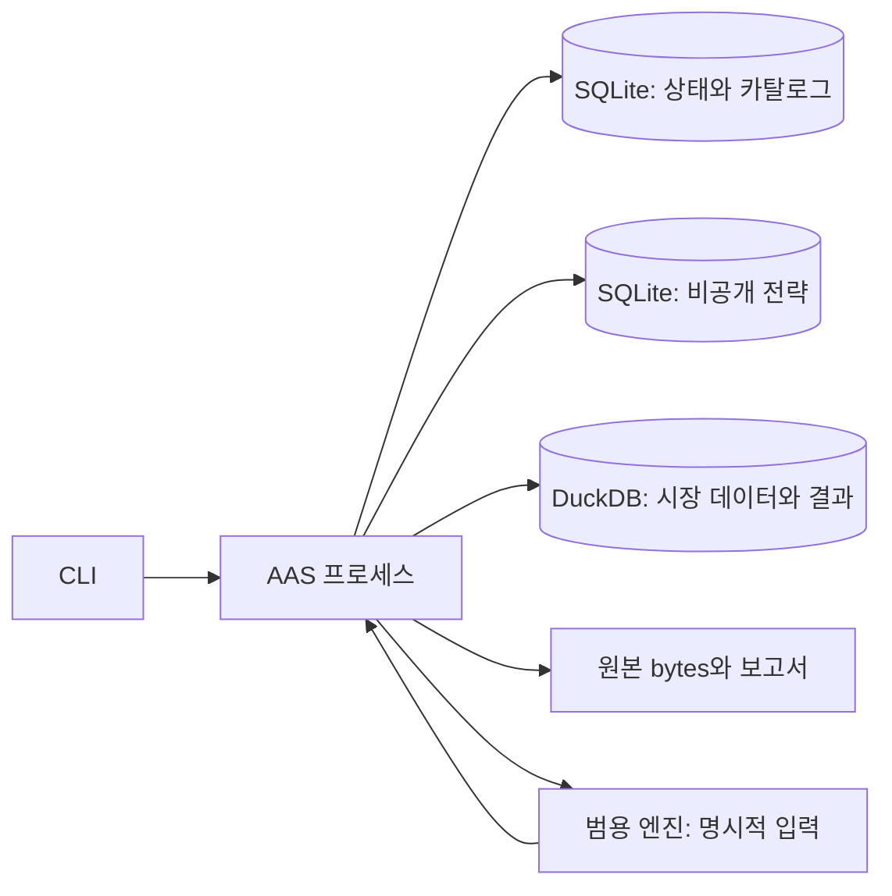

# AAS 로컬 DB 설계

[0014](../decisions/0014-local-embedded-databases.md)에 따른 **구현 대상 설계**다.
현재 CLI의 기본 DB 경로는 `storage/`의 SQLite·DuckDB 구현이다.
이 문서에는 구현된 로컬 경로와 후속 수집·전체 백테스트 계약이 함께 있다. 아래 물리 테이블은
소유 schema 파일이 정본이며, 테이블이 존재해도 호출자와 실행 흐름이 연결됐다는 뜻은 아니다.
제품 책임은 [0015](../decisions/0015-research-engine-product-boundary.md)를 따른다.
[전환 표](#전환-계획과-기존-코드)에서 항목별 현재 상태와 남은 검증을 구분한다. 설치는 [0013](../decisions/0013-first-install-workspace.md),
현재 실행 상태는 [architecture](../architecture.md), 실제 명령은 [operations](../operations.md)가 소유한다.

## 저장소와 실행 소유자

| 위치 | 정본 | 쓰기 주체 |
| --- | --- | --- |
| `state.sqlite3` | 종목·식별 이력·출처·데이터 카탈로그·작업·권한·입력 pin·실행 영수증 | AAS 상태 저장 계층 |
| `strategies.sqlite3` | 비공개 전략 원문·실행 정의·버전·원본 성과·변형 계보 | 명시적 전략 등록 명령 |
| `market.duckdb` | 가격·재무·거시·기업행동·feature·대량 실행 결과 | AAS 시장 데이터·결과 writer |
| `raw/<hash-prefix>/<sha256>` | 공급자 응답의 원본 bytes | 수집기의 no-clobber 원본 writer |
| `runs/<run-id>/` | 보고서·차트·추가 실행 산출물 | 해당 run의 결과 writer |

모두 기본 `~/.aas` 아래에 둔다. 큰 시장 DB와 원본 디렉터리는 설정으로 다른 로컬 디스크를
지정할 수 있다. strategy DB는 별도 경로도 지정할 수 있으며 자동 탐색하지 않는다.
전략이 비어 있어도 설치·데이터 조회·합성 예제는 가능하다. PostgreSQL 서비스·DB 계정·
Parquet publication·데이터 배포 서버를 기본 구성에 포함하지 않는다.

다음 그림은 통합 후의 목표 연결이다. 현재 CLI의 데이터 명령과 Python 계산 API는 각각
존재하지만 저장된 입력을 계산·결과 확정까지 자동 연결하지 않는다.

한 설치의 DB 연결은 `storage/workspace.py`가 소유하며 연결 수명 전체에 설치·파일 잠금을
유지한다. 외부 디스크와 별도 전략 경로도 한 설치가 소유하고, 다른 설치가 같은 파일을
공유하도록 허용하지 않는다. store ID·설치 ID·실제 파일 정체성을 대조한다.
현재 CLI는 잠금 경쟁 시 기다리거나 소켓에 연결하지 않고 `installation_busy`로 실패한다.
읽기 전용 명령도 이 잠금을 우회하지 않는다.

[0013](../decisions/0013-first-install-workspace.md)의 상시 프로세스·로컬 소켓·예약 실행은
승인됐지만 미구현인 설계다. 이식 후에도 한 프로세스가 저장을 소유하고 별도 계산 프로세스에는
검증한 입력만 넘겨야 한다. DB 연결과 비밀키를 넘기지 않는다. 로컬 소켓의 사용자·설치 ID 검증,
구조화 명령·크기 제한, 연결 실패 시 두 번째 writer 금지는 그 후속 구현의 검증 조건이다.

DuckDB는 내장 모드에서 한 읽기·쓰기 프로세스 안의 여러 thread를 지원한다.
각 작업은 별도 connection을 사용하고, 게시와 결과 확정은 짧은 직렬 구간으로 조정한다.
긴 수집 HTTP 호출과 백테스트 계산 동안 DB transaction이나 상태 쓰기 잠금을 잡지 않는다.
[동시성 근거](https://duckdb.org/docs/current/connect/concurrency).

## 공통 타입과 무결성

- ID는 불투명 text, version은 text, sequence는 정수다. 티커·파일 경로·날짜만으로 ID를 만들지 않는다.
- 시각은 UTC microsecond 정수(`*_at_us`), 날짜는 검증된 ISO 날짜를 SQLite TEXT/DuckDB DATE로
  저장한다. 원래 시간대와 세션 calendar도 버전으로 보존한다. 날짜를 UTC 자정으로 추정하지 않는다.
- SQLite는 STRICT table, NOT NULL, CHECK, UNIQUE, FK와 필요한 trigger를 사용한다. 매 연결에서
  `foreign_keys=ON`을 설정·확인한다. WAL, `synchronous=FULL`, 제한된 busy 대기를 기본으로
  검증하고 DB 파일이 로컬 파일시스템인지 확인한다. WAL은 여러 DB의 공통 transaction이 아니다.
- 금액·가격·비중은 계약에 지정한 scale의 Decimal이다. DuckDB는 DECIMAL, SQLite 메타데이터는
  정규 Decimal 문자열로 저장하고 입력에서 검증한다. 수량도 소수 거래를 지원한다. DOUBLE은
  근사 feature·통계에만 허용하고 비유한 수를 거부하며 해당 계약의 허용오차를 기록한다.
- 값이 없는 관측은 `value_state`와 null을 함께 기록한다. `missing/not_collected/unsupported/
  invalid`를 0으로 바꾸지 않는다. 원본 이상값은 raw에 보존하고 사용 가능 여부를 따로 판단한다.
- hash는 `algorithm + format_version + digest`로 식별한다. 기존 raw byte hash와 기존 canonical
  hash를 바꾸지 않는다. 새 DB 논리 hash는 별도 `aas-rowset-v1` 형식이며 이전 hash와 같다고 주장하지 않는다.
- 각 DB의 `schema_migrations(version, checksum, applied_at_us)`와 `store_info(store_id,
  installation_id, schema_version)`로 파일 정체성과 schema를 검증한다. 이름만 같은 DB를 열지 않는다.

SQLite FK의 연결별 활성화와 WAL의 제한은
[FK 문서](https://www.sqlite.org/foreignkeys.html), [WAL 문서](https://www.sqlite.org/wal.html)를 따른다.
DuckDB의 PK·UNIQUE·CHECK·NOT NULL·내부 FK는 지원되는 범위에서 사용한다.
PostgreSQL의 exclusion constraint나 trigger를 DuckDB에도 있다고 가정하지 않는다.
[DuckDB 제약](https://duckdb.org/docs/current/sql/constraints).

## state.sqlite3: 종목·출처·작업·실행

아래는 목표 테이블의 책임과 최소 필드다. 현재 DDL은
[state_schema.py](../../src/aegis_alpha/storage/state_schema.py), 전략 DDL은
[strategy_schema.py](../../src/aegis_alpha/storage/strategy_schema.py), 시장 DDL은
[market_schema.py](../../src/aegis_alpha/storage/market_schema.py)가 소유한다.
전체 writer·reader·실행 연동 여부는 이 표가 아니라 전환 표로 판정한다. `PK(a,b)`는 복합키, `FK`는 **같은 파일 안의**
외래 키다. 기본키·필수 참조는 NOT NULL, 선택 필드의 null 의미는 표와 시간 규칙에 따른다.
대량 관측을 JSON 한 열에 넣는 방식은 사용하지 않는다.

| 테이블 | 주요 필드·키 | 제약과 조회 |
| --- | --- | --- |
| `issuers`, `instruments` | issuer PK; instrument PK, issuer FK nullable(issuer 없는 상품), asset_type, venue | 시장·상장 장소·상품 분리. instrument 영구 ID 유지 |
| `identity_assertions` | assertion PK, instrument FK, provider/namespace/token, valid_from/to, known_from, supersedes_assertion FK nullable, source FK, source_hash | 불변 주장·명시적 정정 chain. 기존 행의 유효·지식 종료를 UPDATE하지 않음 |
| `identity_snapshots`, `identity_snapshot_members` | snapshot PK/hash, member PK(snapshot,ordinal), assertion FK, projected valid_from/to·known_from/to | 새 snapshot에 투영한 구간을 저장·hash 고정. 그 snapshot 내 같은 provider key의 유효·지식 구간 중첩 거부 |
| `universe_versions`, `universe_members` | PK(universe,version), hash; member PK(version,instrument,valid_from,known_from), membership_end/known_end/source FK | 상장·상폐·편입·편출 이력. 현재 구성으로 과거 유니버스 대체 금지 |
| `source_snapshots`, `source_files` | snapshot PK, provider, request/retrieval/publication 시각, status; PK(snapshot,path), byte_hash, size | 원본 상대경로·해시·크기 검증. publication null=알 수 없음, 조회 자격과 별개 |
| `datasets` | dataset PK, domain, record_schema, owner | 지원 도메인·schema 명시; 임의 table 이름이나 SQL 저장 금지 |
| `dataset_versions`, `dataset_sources` | PK(dataset,version), generation_id UNIQUE, parent FK nullable, chain_hash, manifest_hash, schema, normalizer_version/transform_hash, identity_snapshot_hash, authority_policy_hash, row_count, coverage, status; source refs FK | 부모는 같은 dataset, 순번 연속, committed 내용 변경 거부; 단일 상태만으로 coverage 완전성 주장 금지 |
| `quality_checks`, `eligibility_events` | check PK, dataset/version FK, rule/version, result, reason; event PK, scope, authority_ref, time, decision | 실패·차단·미검증 기록 유지. 권한·품질·coverage를 각각 판정; 준비 안 됨을 성공으로 덮지 않음 |
| `authority_records`, `authority_revocations` | authority PK, payload_hash, signer, scope, valid interval, signature; revocation PK, authority FK, known_at | 기존 외부 registry pin·서명·만료·철회 검증 유지. secret 값은 별도 파일 |
| `collection_jobs`, `collection_attempts` | job PK, provider/dataset/window/policy_hash, idempotency_key UNIQUE; PK(job,attempt), status/timestamps | 계획과 실제 호출 구분. 불확실한 attempt를 성공·미실행으로 바꾸지 않음 |
| `usage_events`, `watermarks` | event PK, attempt FK, kind, units, receipt_hash; watermark PK(provider,dataset,partition), committed_version FK | 호출 전 예산 예약, 불확실 호출은 정산 보류. 해당 partition의 검증 완료 후에만 watermark 전진 |
| `feature_contracts`, `feature_inputs` | PK(name,version), definition/schema/hash; PK(contract,ordinal), typed input_ref/hash | 순서와 의존 버전 고정. 순환 참조·동일 key 다른 정의 거부 |
| `conventions` | PK(kind,id,version), payload/hash | calendar, FX 경로, basis, 비용·체결·benchmark·무위험금리 규칙. 데이터값은 dataset 참조 |
| `input_bundles`, `input_bindings` | bundle PK/hash, schema; PK(bundle,role,ordinal), ref kind/id/version/hash | identity/universe/feature/convention·generation refs. 미지정 role·중복·mutable latest 거부 |
| `runs`, `run_events` | run PK, prior_run_id FK nullable(최초 실행), bundle FK, engine/environment hash, seed/reason, status; PK(run,sequence), time/kind/reason | 재계산은 새 run ID로 연결. 상태 전이·이벤트 순서·성공 결과 해시 일치; 실패 이력 유지 |
| `run_strategies` | PK(run,module,ordinal), strategy_store_id, strategy_id/version, raw/contract hash | 다른 SQLite 파일에 FK 없음. 실행 전 실물 조회·hash 검증, 사용 중 version 삭제 금지 |
| `module_manifests`, `compositions` | PK(run,module), output_schema/hash/count; composition PK, decision_at, input_output_refs, budgets/hash | module·run·판단시점·입력 pin 일치. signal과 target·노출 타입 구분 |
| `run_metrics` | PK(run,metric,definition_version), value/state, benchmark_ref/risk_free_ref/cost_ref, comparison_condition_hash | 원래 전략 성과와 재실행 성과를 혼합하지 않음. 비교 조건 불일치 표시 |
| `artifacts` | PK(run,relative_path), media_type, size, hash | 완료 전에 fsync·no-clobber 확정. 경로 이탈·symlink 교체 거부 |
| `storage_operations` | operation PK, kind, request_hash, target_id, expected_parent, payload_hash, phase, failure_reason | DB 간 게시·결과 확정·전략 등록의 durable intent. 요청 해시 없는 중복 재실행 거부 |

자주 쓰는 보조 인덱스는 provider key와 시간 구간, dataset/version/상태, job 상태·예약 시각,
run 상태·strategy ID·생성 시각, 모든 FK child 열이다. payload JSON은 버전 있는 설정·근거의
envelope로만 쓰고, ID·시간·상태·query key는 실제 열로 만든다.

식별자 정정은 새 assertion과 새 snapshot으로 기록한다. 이전 snapshot의 member에는
assertion ID와 당시 투영한 유효·지식 구간이 함께 고정돼 hash에 포함된다. 새 정정으로
과거 assertion이나 snapshot의 known_to를 바꾸지 않는다. 구간 중첩 검사는 raw 주장 전체가
아니라 해당 snapshot의 해결된 투영에 적용하며 충돌한 원본 주장은 미해결 상태로 보존한다.
유니버스 정정도 새 universe version을 만들고 이전 membership 구간을 수정하지 않는다.
구현된 두 문서의 정확한 bytes·hash 형식과 등록·검증 API는
[membership pins](membership-pins.md)가 소유한다.

## strategies.sqlite3: 독립 비공개 정본

| 테이블 | 주요 필드·키 | 계약 |
| --- | --- | --- |
| `strategies` | strategy PK, name, lifecycle | 이름은 identity가 아님. archive는 실행 기본 선택에서 제외하며 이력 보존 |
| `strategy_versions` | PK(strategy,version), raw_bundle BLOB, raw_sha256, contract_json/hash, rule_schema, engine_compatibility, imported_at | 원본 bytes 그대로 보존. 같은 ID·version·hash는 재등록 가능, 같은 ID·version 다른 hash는 충돌 |
| `strategy_lineage` | child FK, parent FK, change_kind, reason/hash | source와 effective version 분리, 순환 참조 거부. 외부 parent는 explicit unresolved 상태로 보존하고 실행 차단 |
| `strategy_sources` | source PK, version FK, origin_ref, source_hash, license/provenance | 불명 출처를 검증됐다고 표시하지 않음. 개인 경로·키가 공개 패키지로 나가지 않음 |
| `strategy_requirements` | PK(version,role,ordinal), required_schema/field/domain, warmup, basis, cadence | 자산·기간·임계값·비중·규칙은 이 비공개 DB에만 존재 |
| `reference_metrics` | metric PK, version FK, value/state, period, universe_ref, risk_free_ref, cost/execution/benchmark/risk_free 조건 hash, source FK | 원본 성과 불변. 조건 없는 성과는 직접 비교 불가로 표시 |
| `strategy_imports` | operation PK, request_hash, version FK, completed_at | raw+parsed+lineage+요구사항+영수증을 한 SQLite transaction에서 기록 |

이 표의 version FK와 이를 포함하는 키는 모두 `(strategy_id, version)` 복합 참조다.
서로 다른 전략의 같은 버전 문자열이 충돌하거나 연결되는 일이 없어야 한다.

전략 실행에는 SELECT-only connection을 사용하고 등록 명령만 writer를 연다. SQLite의 읽기전용
연결은 이 연결의 쓰기를 막는 것이며, 같은 OS 사용자의 별도 파일 접근까지 막지 않는다.
공개 테스트는 합성 strategy bundle과 독립 기대값만 사용한다. 실제 전략을 라이브러리
기본값이나 패키지 설치 의존성으로 넣지 않는다. 임의 Python 코드를 bundle에서 실행하지 않는다.

전략 DB가 없거나 맞지 않으면 해당 전략 실행은 중단하지만 앱 상태와 시장 데이터는 열 수 있다.
전략 파일을 교체하면 store_id를 다시 확인한다. 실행이 참조한 version을 조용히 다른 DB의
동명 version으로 대체하지 않는다. 첫 버전은 실행에서 참조한 전략의 물리 삭제를 제공하지 않는다.

## market.duckdb: 대량 테이블

공통 관측 열은 `generation_id`, `record_id`, `revision_id`, `supersedes_revision_id`,
`op`(ASSERT/SUPERSEDE/TOMBSTONE), 경제적 유효일·기간, `available_at_us`,
`revision_known_at_us`, `ingested_at_us`, `source_snapshot_id`, `source_row_hash`다.
PK는 `(generation_id, record_id, revision_id)`이며 record_id는 도메인의 자연키로 만든
버전 있는 안정 ID다. 미래 수정은 기존 행 UPDATE 대신 새 revision으로 추가한다.
도메인 테이블에서 `(record_id, revision_id)`도 UNIQUE다. supersedes는 같은 record의
revision을 가리키며 그 revision이 고정된 부모 generation chain에 속하는지 writer가 확인한다.
`supersedes_revision_id`는 최초 ASSERT에서만 null이며 SUPERSEDE·TOMBSTONE에는 필수다.
공개·수정 인지 시각은 근거가 없으면 null로 보존하되 PIT 사용을 차단한다.

| 테이블 | 도메인 열·자연키 | 추가 계약 |
| --- | --- | --- |
| `market_generations` | generation PK, dataset/version, parent, sequence, schema, delta_hash/chain_hash, row_count, operation_id UNIQUE, request_hash | 단일 DuckDB transaction의 완료 영수증. state의 committed 카탈로그와 일치해야 조회 허용 |
| `prices` | instrument, session_date, interval/bar_end, basis, currency, OHLCV, price_role | PIT 정본은 unadjusted. 공급자 snapshot 조정값은 reference로 분리. 거래량 0과 결측 구분 |
| `corporate_actions` | instrument, action_id/type, ex/record/pay/effective dates, amount/ratio/currency | 배당·분할·합병·상폐 대금 구분. 미래 action을 과거 조정에 쓰지 않음 |
| `instrument_status` | instrument, status_event_id, effective_from/to, status, reason | 종목별 거래정지·재개·상장·상폐 이력. 거래소 calendar와 함께 체결 가능성을 판정 |
| `fundamentals` | 자연키: issuer/instrument, concept, period_start/end, fiscal_period, unit, dimensions_hash; revision 속성: form/accession/accepted_at, value/state | accession 변경은 새 자연키가 아님. 재공시는 같은 항목의 SUPERSEDE로 연결 |
| `macro_observations` | 자연키: series, observation_period, unit; revision 속성: source_vintage_start/end, value/state | 원본 vintage 구간은 수집 당시 응답값 그대로 보존. 지식 종료는 revision chain에서 도출 |
| `estimates` | instrument, metric, target_period, as_of, statistic, value/state, analyst_count nullable | 전망 대상 기간과 발표 시점을 분리. 출처·자격 미확인 추정치는 실행 입력 차단 |
| `fx_rates`, `calendar_sessions` | base/quote·fixing_time·rate/state; calendar/venue·session_date·open/close/status | 환산 경로·휴장·조기 종료·time zone 버전 고정 |
| `feature_values` | contract id/version/hash, input_bundle_hash, instrument, feature_time, value/state | 입력 핀과 계산 정의를 고정. warmup 미달을 0으로 채우지 않음 |
| `result_commits` | run PK, operation_id UNIQUE, request_hash, manifest_hash, table_hashes/counts | 결과 전체의 DuckDB commit marker. state 완료와 맞아야 성공 결과로 노출 |
| `signals`, `target_weights`, `simulated_trades`, `positions`, `equity_points` | run, module, decision/fill timestamp, instrument, typed values, row ordinal | PK(run,table-specific ordinal). target 비중과 체결·보유·손익을 각기 저장, 주문 전송 기능 없음 |

모든 DuckDB 도메인 열은 명시한 타입·NOT NULL·CHECK로 제한한다. `source_snapshot_id`,
`instrument_id`, `run_id`의 다른 파일 참조는 writer가 같은 작업의 pinned SQLite snapshot과
검증하고 승인된 ID만 배치에 포함한다. 내부 FK와 DB 간 검증을 혼동하지 않는다.

도메인 열 중 값·근거 미확인 시각·열린 구간의 끝은 명시적 상태와 함께 null을 허용한다.
fundamentals 재공시는 동일 항목의 비교열이어도 accession마다 별도 정본으로 세지 않는다.
macro 원본의 vintage 종료값은 in-place로 닫지 않고 다음 revision의 지식시각으로 가시성을
계산한다. source의 변경을 재수집했다면 새 source·revision과 계보를 남긴다.

generation별 증분 행을 저장하고 카탈로그가 부모 chain과 내용 해시를 고정한다. 데이터 전체를
새 버전마다 복사하지 않는다. 새 generation은 한 부모만 가지며 기존 chain을 바꾸지 않는다.
조회는 bundle에 고정된 generation까지의 chain만 사용한다. 장기 실행의 pin은 수집으로 새
head가 생겨도 바뀌지 않는다. 자동 compaction·VACUUM·이력 삭제는 첫 버전에 넣지 않는다.

DuckDB 물리 파일 hash는 논리 dataset hash가 아니다. 한 테이블이 추가돼도 전체 파일 bytes가
달라지므로 dataset 식별에는 `aas-rowset-v1`을 쓴다. 정렬된 자연키·revision 순서로 schema와
각 행을 길이 접두 필드로 직렬화하며, type tag·null·Decimal scale·UTC 값·정규 IEEE float 표현을
구분한다. NaN/Infinity는 거부하고 -0 정책도 schema에 명시한다. delta hash에 부모 chain hash,
source hash와 schema version을 결합한다. 같은 행 중복, 반올림, row 순서 차이를 숨기지 않는다.
현재 codec과 합성 기대값은 [rowset.py](../../src/aegis_alpha/storage/rowset.py)와
[검증 예제](../../tests/storage/test_rowset.py)가 소유한다. 문서 표만으로 codec을 다시 구현하지 않는다. 백업은 별도 물리 파일 hash도 기록한다.

## 시간·수정·상장 이력 조회

경제 유효 시각, 공개 시각, 수정 인지 시각, 수집 시각을 별도 열로 유지한다.
`available_at_us` 또는 `revision_known_at_us`가 불명확하면 inspection만 허용하며 PIT 입력에서
배제한다. 최초 ASSERT의 revision 시각도 source 공개 근거에서 결정한다. 수집 시각으로 채우지 않는다.
오늘 수집한 과거 공시의 근거가 확인되면 과거 knowledge로 사용할 수 있고, 오늘 발표된 수정본은
발표 이전의 판단에 사용할 수 없다. strict observed 시스템 재생은 추가로 ingested cutoff를 고정한다.

각 판단 시각 T에서 조회 순서는 다음과 같다.

1. bundle의 exact generation·identity/universe snapshot·feature·시장 관례를 확인한다.
   논리 내용 hash는 게시·복원·명시적 verify에서 전체 검증하고, 조회에서는 소유 프로세스가
   검증한 불변 generation의 카탈로그·marker·pin 일치 결과를 재사용한다. 매 T마다 전체 DB를 해싱하지 않는다.
2. 해당 generation chain만 선택하고 `available_at_us <= T`와 `revision_known_at_us <= T`를 적용한다.
3. 같은 자연키에서 그 시점에 알려진 revision chain을 재생한다. SUPERSEDE는 명시적 이전
   revision을 가리키고, TOMBSTONE은 그 시점 이후 관측을 제거한다. 충돌·순환·모호한 동순위는 거부한다.
4. identity와 universe의 유효 구간·지식 구간을 함께 적용한다. 티커 재사용과 상폐 종목을 검증한다.
5. basis·통화·coverage·warmup·당시 사용 자격을 확인하고 정렬된 typed 데이터와 누락 사유를 반환한다.

PIT용 분할조정·총수익 가격은 `read_prices`가 고정된 unadjusted 가격과 corporate action
generation으로 계산한다. T까지 공개·인지됐고 해당 조정 규칙의 적용일도 T를 넘지 않는
action만 사용한다. 규칙 ID·버전·raw/action 입력·T·환산 조건을 결과 계보에 기록한다.
공급자가 오늘 제공한 조정 이력은 `price_role=reference`인 snapshot 참고값으로 남기며,
가용 시각을 거래일로 소급해 PIT 입력으로 승격하지 않는다. 원가격·action 근거가 부족하면
그 basis는 사용할 수 없다고 표시한다. 파생값 cache도 동일 입력 pin과 T에만 재사용한다.

현재 허용되는 공급자 사용 scope와 과거 knowledge cutoff는 별개다. 과거에 알려졌던 데이터라도
현재 철회된 권한으로 새 수집을 할 수 없다. 재실행 허용은 보존 데이터의 해당 scope를 확인한다.
상폐·휴장·실패한 수집·미지원 필드를 생존 종목이나 최신 자료로 대체하지 않는다.

## DB 간 저장과 장애 복구

로컬 데이터 게시·전략 등록과 영수증 기반 재개는 구현돼 있다. 아래의 공급자 예산·watermark
결합 및 run 결과 SUCCESS 확정은 후속 통합 계약이다. 현재 `recover`는 marker가 없으면
pending을 남기고 임의 재실행하지 않는다. 호출자는 미완료 상태를 처리해야 한다.

SQLite 두 파일과 DuckDB·원본 파일에 걸친 공통 ACID transaction은 없다. 앱이 `storage_operations`
의 의도 기록과 대상 DB의 완료 영수증을 대조해 게시를 확정한다. 단일 프로세스여도 이 절차가
필요하다. DuckDB transaction 자체의 격리·commit은 [공식 계약](https://duckdb.org/docs/current/sql/statements/transactions)을 따른다.

| 순서 | 쓰기·가시성 |
| --- | --- |
| 1. 준비 | state transaction에서 operation ID·요청 hash·부모 pin·목표 ID를 저장. 상태 PREPARED. 아직 reader에 노출하지 않음 |
| 2. 원본 | 임시 raw 파일을 쓰고 fsync·hash·크기를 검증한 후 hash 경로에 no-clobber 저장. source_snapshots/files를 raw_verified 상태로 state에 등록; dataset 게시·자격 승격과 구분 |
| 3. 내용 확정 | DuckDB transaction에서 typed 관측과 `market_generations`를 함께 commit. 대량 입력은 staging 후 검증·일괄 commit |
| 4. 게시 | 대상 marker·실제 행 hash/count·source를 확인. state transaction에서 dataset/version·출처·eligibility·해당 watermark·operation COMPLETED를 함께 기록 |
| 5. 읽기 | state committed 카탈로그와 DuckDB marker가 일치하는 generation만 제공. 최신 물리 행을 직접 읽지 않음 |

전략 등록은 3단계 대신 strategies DB의 version·원문·검증 결과·`strategy_imports` 영수증을
한 transaction으로 commit한다. state 쪽 등록 완료 표시는 그 영수증을 확인한 뒤 기록한다.
전략 정본은 해당 SQLite이고 state의 등록 알림은 정본이 아니다. run 결과도 동일하게
result_commits와 보고서 파일 검증 후 state의 SUCCESS·결과 참조를 마지막 transaction에서 확정한다.

| 중단 지점 | 다음 기동의 처리 |
| --- | --- |
| PREPARED만 있음 | 저장만 재시도 가능. provider 호출 여부는 collection_attempts에서 별도로 판정 |
| raw만 저장됨 | 검증된 원본부터 재처리. 기존 원본 덮어쓰기·유료 재호출 금지 |
| 대상 DB commit 후 state 미완료 | operation ID·요청 hash·parent·실제 내용·원본을 검증해 마지막 게시만 재개. run에도 이 규칙을 먼저 적용 |
| state 완료, 대상 marker 없음/다름 | 저장소 불일치로 해당 입력 차단. 자동 성공 복원이나 삭제 금지 |
| intent 없는 대상 데이터 | orphan으로 격리 표시. latest나 정상 카탈로그로 자동 채택하지 않음 |
| result_commits가 검증됨, state SUCCESS 없음 | 동일 run·operation으로 SUCCESS 확정만 재개. 계산은 다시 실행하지 않음 |
| result_commits 없음, 실행 도중 중단 | 기존 run을 interrupted로 유지. 재계산은 새 run_id와 prior_run_id로 연결; 기존 staging은 미완료로 보존 |
| result_commits와 intent·hash 불일치 | 해당 run을 quarantine으로 차단. 기존 결과를 덮거나 새 SUCCESS로 승격하지 않음 |

첫 버전은 generation 게시를 dataset별 순서대로 확정한다. 부모 CAS가 달라지면 새 요청으로
다시 계획하며 이미 commit된 증분을 다른 부모로 붙이지 않는다. 장애 복구가 끝나기 전에는 새
쓰기를 받지 않는다. 완료 영수증만으로 데이터가 맞다고 가정하지 않고 대상 hash/count를 확인한다.
복구는 결과 commit 검증을 interrupted 판정보다 먼저 수행한다. result_commits가 있으면
state storage_operations의 request_hash·manifest_hash·table hash/count·보고서 실물을 대조한다.
marker가 없는 임시 결과는 정상 결과 테이블 조회에 노출하지 않는다. 이미 종료된 run_id로
재계산해 PK를 재사용하지 않는다. 저장 재개와 새 계산은 서로 다른 동작이다.

## 실행 입력·전략 성과·결과

이 절은 후속 통합 실행 계약이다. 아래 `read_*`는 설계상의 역할 이름이며 현재 공개 API
목록이 아니다. 현재 명시적 입력 계산은 `engine.replay`, 저장 조회는 `storage/publication.py`와
`market.py`·`market_inputs.py`가 제공한다. 입력 조합 쪽은 `application/backtest_prepare.py`가
요청의 exact pin으로 전략·관례·세션·가격·membership·조건부 입력을 읽어 판단별 목표 비중과
출처 문서를 만드는 데까지 연결됐다. run 할당, 요청 바이트의 run 결합, 회계 결과의
`result_commits`·state SUCCESS 확정과 복구는 아직 연결되지 않았다.

엔진에는 SQL이나 DB 파일을 넘기지 않는다. `read_prices`, `read_universe`, `read_fundamentals`,
`read_macro`, `read_features`는 bundle, window, decision cutoff와 필요한 basis를 받는다.
결과는 typed 관측과 source·quality 참조다. 메모리 예산과 chunk 크기를 공유해 중복 전체 적재를 피한다.

한 run은 전략 ID·버전·raw/contract hash, dataset generation, identity/universe, 비용·체결·FX·
calendar·benchmark·risk_free_ref, 평가 기간·각 판단 시각 정책, engine/environment revision과 난수 설정을 고정한다.
학습·검증·평가 구간, optimizer 탐색 이력과 모델 생성 근거도 명시한다. 이를 저장했다고 모델의
사전학습 누수가 제거됐다고 주장하지 않는다. 전략 규칙과 실제 성과는 모두 비공개 저장소다.

전략 DB의 reference_metrics는 원래 성과, state의 run_metrics는 재실행 성과다. 기간·universe·
basis·비용·체결·benchmark·무위험금리의 데이터/규칙 버전 등 비교 조건이 같은 경우에만 차이를 계산하고, 누락 조건이 있으면
비교 불가 이유를 남긴다. 수익률 수치를 원본에 덮어쓰거나 비교를 위해 원래 조건을 수정하지 않는다.
무위험금리나 해당 지표의 필수 입력이 없으면 Sharpe 등 관련 위험조정 지표를 계산 완료로
표시하지 않고 원본과의 비교는 `not_comparable`로 남긴다. 금리 0을 암묵적 기본값으로 채우지 않는다.

세 모듈 결과는 run·module·판단시각·output schema별로 검증한다. 신호, 목표 비중, 방어 판단과
파생상품 노출은 다른 타입이다. 현재 preview의 자본 비중 계약을 옵션 델타나 선물 증거금으로
확장 해석하지 않는다. 역사 `risk` 이름은 의미를 확인한 명시적 mapping에서만 `hedge`로 연결한다.
모든 module 결과·trade·position·equity의 검증과 참조가 끝나야 run을 SUCCESS로 확정한다.

## 백업·복원·업그레이드

백업은 앱의 유지보수 작업이다. 새 쓰기·전략 등록·수집을 막고 진행 작업을 완료 또는 안전하게
중단한 뒤 pending operation을 정리한다. 백업 전체가 끝날 때까지 쓰기 차단과 설치 잠금을 유지한다.
SQLite는 backup API, DuckDB는 CHECKPOINT와 모든 connection의 정상 종료 뒤 복사를 사용한다.
DB 내부 transaction만으로 세 파일의 snapshot이 일치한다고 주장하지 않는다.
긴 분석이 끝나지 않아 DuckDB 연결을 닫지 못하면 백업은 대기 또는 명시적 실패로 끝난다.
실행 중인 query를 남겨두고 파일만 복사하지 않는다. 프로세스 안의 모든 writer와 별도
명령의 설치 잠금을 함께 막아야 유지보수 상태가 성립한다.

백업 세트에는 세 DB, 참조 raw·runs 파일, 비밀값 없는 설정, 설치/schema/engine 버전, 각 파일의
크기·hash, 논리 generation·전략 버전·실행 결과의 검증 manifest를 포함한다. SQLite WAL을 무시한
살아 있는 파일 복사를 쓰지 않는다. SQLite backup은 개별 DB의 일관된 snapshot을 만든다.
[SQLite backup API](https://www.sqlite.org/backup.html).

백업 중 부분 파일은 완료 표시가 없다. 다른 로컬 디스크 경로를 사용했어도 참조 자료 전체를
포함하고, 동일 디스크 백업이 디스크 장애를 보호한다고 안내하지 않는다. DB만 복원되고 raw가
없거나 hash가 다르면 복구 미완료다. secrets는 기본 제외하고 복원 후 다시 등록한다.

복원은 새 루트에 hash·schema·FK·논리 참조·PIT 대표 조회·전략과 결과 해시를 검증한 뒤 활성화한다.
현재 루트에 덮어쓰지 않는다. 다른 위치로 이동해도 ID·논리 hash·입력 pin은 유지한다.
복원된 DB의 논리 store_id는 유지하되 새 배포 인스턴스 식별자는 별도 발급해 경로·잠금을 재생성한다.

schema upgrade는 미구현이다. 후속 구현은 설치 잠금+백업 이후 대상 schema version과 script checksum을 기록하며 수행한다.
SQLite와 DuckDB 중 하나만 성공하면 설치는 migration-incomplete로 남고 호환되지 않는 앱은
기동하지 않는다. 재개 또는 새 루트 백업 복원만 허용한다. 이미지 rollback이 DB downgrade를
자동 해결하지 않는다. DB 파일 형식과 앱 schema의 호환성 검사는 각각 수행한다.

## 전환 계획과 기존 코드

같은 SQL을 모든 DB에 돌리는 호환 계층을 만들지 않는다. 기존 value model·파서·해시·시점·
권한 검증을 재사용하고 새 저장소에 맞춘 전용 SQL과 adapter를 작성한다. 다음 경로는 제안이다.

| 단계 | 현재 상태와 소유 코드 | 남은 작업과 완료 기준 |
| --- | --- | --- |
| L1 저장소 기반 | 로컬 경로 구현: `storage/paths.py`, `workspace.py`, `locks.py`, `sqlite.py`, 세 schema 파일. `tests/storage/test_workspace.py`에 초기화·잠금·정체성 거부 사례 | 현재 초기화·검증 경로 유지. 자동 schema 업그레이드와 서비스 소유권 인계는 미구현이며 별도 실패·복구 계약 검증 필요 |
| L2 전략·상태 | bundle 등록·로드와 영수증 구현: `strategies.py`, `strategy_import.py`, `state.py`. CLI는 등록·목록 제공; lineage·원래 성과용 schema 존재 | 원래 성과·비교 조건의 전체 입력 경로, 실행 입력 bundle·run 소비자 연결 필요. schema만으로 DB 재실행 완료를 주장하지 않음 |
| L3 시장·publication | typed JSON import, generation·revision 조회, 중단 게시 재개 구현: `import_document.py`, `market.py`, `publication.py`; `tests/storage/test_market.py`, `test_publication.py`에 합성 사례 | 기존 `data/catalog_access.py`·`pinned_prices.py`, identity/metadata 소비자와 수집기 전환 필요. 도메인별 품질·사용 자격과 전체 입력 고정 검증은 별도 |
| L4 수집·실행 | `collection/`, `data/`의 공급자 도구와 `application/daily_collection.py`는 전환 전 경로. 저장 전략→고정 입력→계산→봉투는 `application/backtest_prepare.py`·`aas prepare`가 SELECT-only로 연결(`tests/application/test_backtest_prepare.py`, `test_prepare_cli.py`에 합성 사례); 봉투 회계는 기존 `aas backtest`. `storage/run_schema.py`의 run 추가 스키마와 `backtest_requests.py`의 정규 요청 저장 API를 `application/run_backtest.py`·`aas run`이 소비해 요청 등록·`open_run`·잠금 없는 계산·`commit_run`·run ID 조회를 잇는다(`tests/application/test_run_backtest.py`에 합성 사례). 명시적 `aas db run-install` 필요 | 수집기 내장 DB 이식, 예산·watermark 결합, 결과 복원 연결 필요. 준비·실행 출력은 `certified=false`이며 불확실 호출·부분 결과·재시작 시나리오를 검증해야 완료 |
| L5 설치·백업 | native CLI와 선택적 단일 이미지, `storage/backup.py`의 일관 백업·새 루트 복원 구현. `tests/storage/test_backup.py`에 합성 복원·손상 거부 사례 | 0013의 상시 앱·소켓·예약 실행, 자동 업그레이드, artifact 게시·실제 자료 이전은 미완료. 구현·게시·운영 검증을 각각 기록 |
| L6 구경로 제거 | PostgreSQL adapter·Alembic chain·Parquet reader와 `legacy` 추가 의존성 유지 | 앞 단계에서 모든 호출자와 실패 계약을 대체한 뒤 미사용 코드·의존성·관련 테스트·CI 선택을 함께 정리. 현재 제거 완료로 표시하지 않음 |

표의 구현 표시는 소스와 테스트의 존재·연결 범위다. 이 문서 변경에서 실제 DB나 공급자를
실행한 증거는 아니다. 후속 작업은 저장 계약→수집·실행 통합→구경로 제거 순서로 진행한다.
L1~L6를 모두 미착수로 취급하거나 모두 완료로 묶지 않는다. 임시 이중 지원은 전환 기간에만
존재하고 최종 설치 선택지가 아니다.
폐기할 코드와 그 코드만 검증하던 테스트는 새 동작 증명이 생긴 단계에서 함께 제거한다.
옛 DB의 실제 복원·추출은 새 설치의 선행 조건이 아니며 이번 문서 작업에서 실행하지 않는다.
필요 시 별도 import로 원본·행수·hash·누락·eligibility를 대조하고 old/new ID의 mapping을 남긴다.
현재 Alembic revision을 수정해 새 schema인 것처럼 사용하지 않는다.

## 필수 검증과 완료 판정

| 검사 | 합성 입력과 실패 사례 |
| --- | --- |
| 설치 | 빈 HOME, 반복·동시 init, 잠금 유지·중단, store ID 혼동, 권한·심볼릭 링크 교체 거부 |
| SQLite | FK 활성화·고아 참조·시간 구간 중첩·완료 내용 변경·같은 key 다른 hash 거부 |
| DuckDB | schema·Decimal·null·중복 revision·원본 참조 누락·논리 hash 불일치 거부 |
| 시점 | accession이 바뀐 재공시의 단일 revision chain, 식별자 정정 후 이전 snapshot hash 보존, T 이후 split 제외, 종목 거래정지, 빈 공개시각, warmup 미달 |
| DB 간 복구 | 위 저장 순서의 각 commit 직후 강제 종료; 재시작 시 부분 결과가 보이지 않고 한 번만 게시 |
| 수집 | 응답 도중 실패·예산 예약 후 crash·중복 명령·불확실 유료 호출; watermark와 잔액 보존 |
| 전략·결과 | 원본 삭제 후 DB 재실행, 별도 파일 교체·version 충돌, 원래 성과 보존, 무위험금리 누락·불일치 비교 차단, result_commits 후 crash는 재계산 없이 SUCCESS 복구 |
| 병렬 실행 | 단일 DuckDB 소유 프로세스, CLI 경쟁, 수집 중 기존 generation 조회, 재시작 후 interrupted 판정 |
| 백업·이전 | SQLite WAL이 있는 상태, pending operation, 별도 데이터 디스크, 손상 backup, migration 중단·새 루트 복구 |
| 배포·CI | wheel/sdist·단일 이미지에서 실제 전략·개인 경로·DB 없음; 합성 전체 실행; PG 없는 테스트 환경 |

재현 기준은 exact 입력·논리 hash와 schema별 수치 허용오차다. 성능은 대표 합성 크기의
종목/기간 조회·재무 join·bulk insert·수집과 분석 동시 작업의 시간·메모리·저장량을 측정한다.
측정 없이 처리량이나 기존 설계보다 빠르다고 주장하지 않는다. 전체 시장 도메인은 유지하며
특정 전략만 통과하도록 가격 몇 종목으로 데이터 모델을 축소하지 않는다.

현재 구현은 빈 설치·전략 원문 저장·typed market generation·시점 조회·게시 재개·
일관된 백업과 새 루트 복원, 관례·pin 문서 등록, 저장 입력의 준비와 봉투 회계, 그리고
그 둘을 이어 run으로 확정하고 run ID로 다시 읽는 것까지다. 공급자 수집기 이식, 결과 복원,
상시 앱 소켓, schema 업그레이드와 실제 데이터 이전·이미지 배포는 완료되지 않았다.
